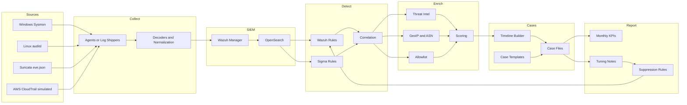

# SOC Monitoring and Incident Response Lab

## Overview
The SOC Monitoring and Incident Response Lab is a hands-on Security Operations Center (SOC)
project designed to demonstrate practical experience in security monitoring, alert triage,
incident investigation, and continuous detection improvement.

The lab simulates a small but realistic enterprise SOC environment by ingesting endpoint,
network, and cloud telemetry into a centralized analysis workflow, correlating events,
enriching alerts with threat intelligence, and producing structured incident documentation
and reports.

This project is intended to reflect the daily responsibilities of a SOC analyst working
in a global, remote-first security team.

---

## Objectives
- Practice security event monitoring and alert triage
- Investigate incidents using multi-source log correlation
- Analyze endpoint, network, and cloud security events
- Apply threat intelligence during investigations
- Produce clear incident documentation and executive summaries
- Improve detections through tuning and false-positive reduction
- Generate SOC metrics and reporting (alert volume, MTTR, trends)

---

## Architecture Summary
**Telemetry Sources → SIEM → Detection & Correlation → Enrichment → Investigation → Reporting**

- Endpoints: Windows (Sysmon), Linux (auditd)
- Network: Suricata IDS
- Cloud: AWS CloudTrail (simulated)
- SIEM: Wazuh + OpenSearch
- Detection: Wazuh rules and Sigma rules
- Enrichment: Threat intelligence feeds, GeoIP, allowlists
- Automation: Python-based triage and reporting scripts
- Reporting: Incident cases, SOC KPIs, executive summaries

Detailed architecture documentation is available in `docs/architecture.md`.

---

## Incident Scenarios
The lab includes documented investigations for:
- Suspicious authentication activity (impossible travel)
- Endpoint malware execution with network correlation
- Cloud IAM privilege escalation attempts

Each case includes alert context, investigation steps, evidence, decisions,
and lessons learned.

---

## Repository Structure
docs/ - SOC documentation, playbooks, and runbooks
infra/ - SIEM, IDS, and lab infrastructure configuration
detections/ - Detection rules, correlation logic, and tuning notes
scripts/ - Automation for triage, enrichment, timelines, reporting
cases/ - Incident case templates and completed investigations
data/ - Sample logs and threat intelligence feeds

---

## Disclaimer
All data in this repository is simulated and used strictly for educational
and demonstration purposes.

---

